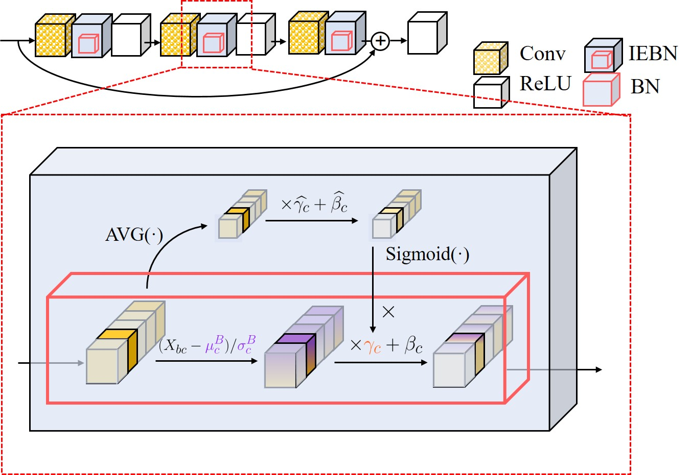

# Instance Enhancement Batch Normalization: an Adaptive Regulator of Batch Noise

This repository is an unofficial Keras implementation of the paper [Instance Enhancement Batch Normalization](https://arxiv.org/abs/1908.04008) by [Senwei Liang](https://leungsamwai.github.io), [Zhongzhan Huang](https://github.com/dedekinds), [Mingfu Liang](https://github.com/wuyujack) and [Haizhao Yang](https://haizhaoyang.github.io/).

The official Pytorch implementation is available here : https://github.com/gbup-group/IEBN

## Introduction
Instance Enhancement Batch Normalization (IEBN) is an attention-based version of BN which recalibrates channel information of BN by a simple linear transformation, this can be used as a droppin replacement of standard BatchNormalization layer. 

  

Please refer to the notebook for an usage example.
